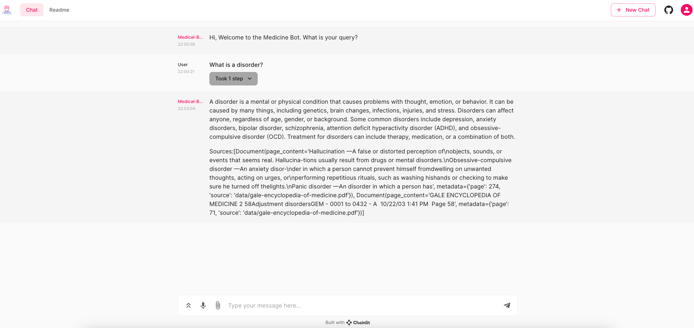
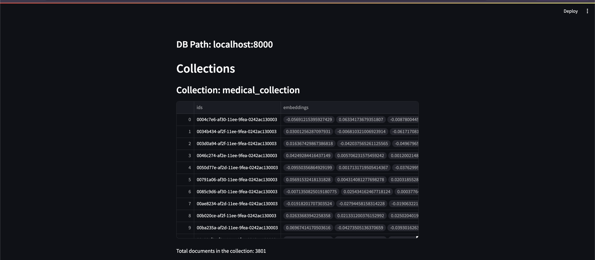

# Retrieval-Augmented-Generation-LLM-app
RAG LLM app using Chainlit to run a Medical Chatbot using Llama2 on CPU. 
The chatbot associated to a Chroma vectorstore is using llama-2-7b-chat model to generate answers and gives sources.
Everything has been containerized and can be run with docker-compose cli commands.

# Instructions

1. Create a HuggingFace account
2. Download the quantized models by running the script `scripts/download_models.py`
3. Create a virtual environment and run `pip install -r requirements.txt`
4. Build the app with `docker compose build`
5. Run the app with `docker compose up -d`

Note: Set the environment variable `RESET_DB` to `true` to automatically load medical documents from the Gale Encyclopedia.
You can check the upload progress through the little Streamlit app showing the Chroma DB documents with the command `streamlit run chroma-viewer/viewer.py`

# Bonus: Chroma Viewer 
I created a quick Streamlit app to get a visualization of my local Chroma vectorstore and check the documents upload process.  
This app is located in the folder `chroma-viewer/` and can be run with the command `streamlit run chroma-viewer/viewer.py -- --host=localhost --port=8000`

# Medium link
Find the related Medium article of the repo here -> 

